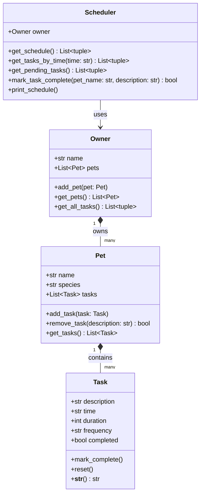

# PawPal+ Project Reflection

## 1. System Design

**a. Initial design**

The system is built around four classes: `Task`, `Pet`, `Owner`, and `Scheduler`.

- **Task** — A single care activity. Holds `description`, `time` (HH:MM), `duration` (minutes), `frequency` (e.g. "daily"), and `completed` status. Provides `mark_complete()` and `reset()` so status can be toggled.
- **Pet** — A pet profile. Holds `name`, `species`, and a list of `Task` objects. Provides `add_task()`, `remove_task()`, and `get_tasks()`.
- **Owner** — The account holder. Holds `name` and a list of `Pet` objects. Provides `add_pet()`, `get_pets()`, and `get_all_tasks()` (a flat list of every task across all pets).
- **Scheduler** — The "brain." Receives an `Owner` and exposes `get_schedule()` (all tasks sorted by time), `get_pending_tasks()`, `mark_task_complete()`, and `print_schedule()` (formatted terminal output).

**UML class diagram (Mermaid.js):**

**b. Design changes**

`Task` and `Pet` were implemented as Python dataclasses (using `@dataclass`) to eliminate boilerplate `__init__` code and keep attribute declarations self-documenting. `Owner` and `Scheduler` remained plain classes because they require richer constructor logic (`Owner` builds an empty list, `Scheduler` takes an `Owner` dependency). No structural changes were needed after the initial UML — the four-class boundary held up cleanly through implementation.

---

## 2. Scheduling Logic and Tradeoffs

**a. Constraints and priorities**

- What constraints does your scheduler consider (for example: time, priority, preferences)?
- How did you decide which constraints mattered most?

**b. Tradeoffs**

- Describe one tradeoff your scheduler makes.
- Why is that tradeoff reasonable for this scenario?

---

## 3. AI Collaboration

**a. How you used AI**

- How did you use AI tools during this project (for example: design brainstorming, debugging, refactoring)?
- What kinds of prompts or questions were most helpful?

**b. Judgment and verification**

- Describe one moment where you did not accept an AI suggestion as-is.
- How did you evaluate or verify what the AI suggested?

---

## 4. Testing and Verification

**a. What you tested**

- What behaviors did you test?
- Why were these tests important?

**b. Confidence**

- How confident are you that your scheduler works correctly?
- What edge cases would you test next if you had more time?

---

## 5. Reflection

**a. What went well**

- What part of this project are you most satisfied with?

**b. What you would improve**

- If you had another iteration, what would you improve or redesign?

**c. Key takeaway**

- What is one important thing you learned about designing systems or working with AI on this project?
