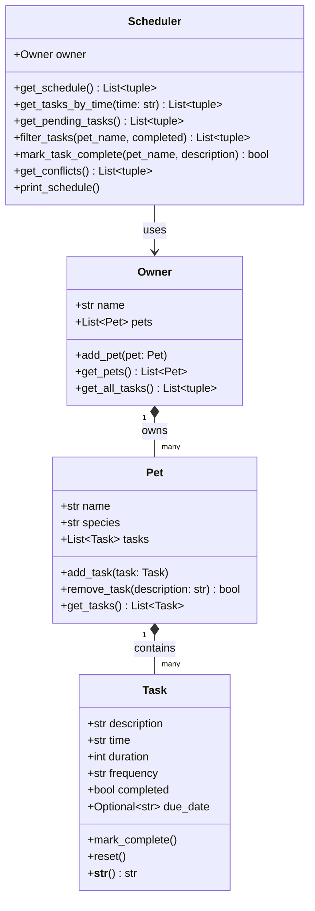

# PawPal+ Project Reflection

## 1. System Design

**a. Initial design**

The system is built around four classes: `Task`, `Pet`, `Owner`, and `Scheduler`.

- **Task** — A single care activity. Holds `description`, `time` (HH:MM), `duration` (minutes), `frequency` (e.g. "daily"), `completed` status, and an optional `due_date` (ISO string) for recurring instances. Provides `mark_complete()` and `reset()`.
- **Pet** — A pet profile. Holds `name`, `species`, and a list of `Task` objects. Provides `add_task()`, `remove_task()`, and `get_tasks()`.
- **Owner** — The account holder. Holds `name` and a list of `Pet` objects. Provides `add_pet()`, `get_pets()`, and `get_all_tasks()`.
- **Scheduler** — The "brain." Receives an `Owner` and exposes `get_schedule()` (time-sorted), `get_pending_tasks()`, `filter_tasks()`, `mark_task_complete()` (with automatic recurrence), `get_conflicts()`, and `print_schedule()`.

**UML class diagram (Mermaid.js):**

**b. Design changes**

`Task` and `Pet` were implemented as Python dataclasses (`@dataclass`) to eliminate boilerplate `__init__` code. `Owner` and `Scheduler` stayed as plain classes because they need richer constructor logic.

During Phase 3, a `due_date: Optional[str]` field was added to `Task` so the recurrence system can tag next-occurrence copies with their scheduled date. `Scheduler.mark_task_complete()` was also extended: instead of just flipping `completed`, it now creates a next-occurrence `Task` and appends it to the pet — a meaningful behavior change that required updating every test that counted tasks after a completion call.

---

## 2. Scheduling Logic and Tradeoffs

**a. Constraints and priorities**

The scheduler currently considers:

- **Time of day** — tasks are sorted by `HH:MM` so the schedule reads top-to-bottom in the order they need to happen.
- **Completion status** — completed tasks remain visible but visually distinguished; `get_pending_tasks()` lets the owner focus on what's left.
- **Frequency** — "daily" and "weekly" tasks automatically recur; "once" tasks do not, which mirrors how a real pet owner thinks about one-off vs. routine care.
- **Interval overlap** — `get_conflicts()` compares every pair of scheduled tasks and flags any whose time windows overlap, so the owner knows when they have physically impossible commitments.

The most important constraint is **time ordering**: a schedule that lists tasks out of order is actively harmful to a busy owner, so sorting is always applied before anything else is surfaced to the UI.

**b. Tradeoffs**

The conflict detector checks for **exact interval overlap** (start_A < end_B and start_B < end_A) rather than flagging only tasks at the identical start time.

*Why this is reasonable:* A pet owner who schedules "Morning walk" at 07:00 for 30 minutes and "Vet call" at 07:20 for 20 minutes cannot physically do both, even though they don't share the exact same start time. Interval overlap catches this real-world constraint without making the logic significantly more complex.

*The tradeoff:* For large schedules with many long tasks this is O(n²) comparisons. A future optimization could use a sweep-line algorithm instead. For typical pet-care use (fewer than ~30 tasks per day) this is imperceptible.

---

## 3. AI Collaboration

**a. How you used AI**

AI assistance (Claude Code) was used throughout:

- **Design brainstorming** — asked for a Mermaid class diagram from a plain-English description of the four classes; this produced a starting point that was then reviewed and adjusted.
- **Algorithm selection** — prompted with "lightweight conflict detection strategy" and compared exact-time matching against interval overlap before choosing the latter.
- **Code generation** — skeleton stubs were generated first, then fleshed out with full logic in a second pass; this two-pass approach kept each step reviewable.
- **Test drafting** — asked for edge cases ("pet with no tasks", "two tasks at the exact same time", "once task that should not recur") and used the suggestions as a checklist.

The most useful prompt pattern was **constraining the scope**: "add only conflict detection to the existing Scheduler class" rather than "rewrite the scheduler" — this produced targeted changes that were easy to review.

**b. Judgment and verification**

One suggested approach was to detect conflicts by checking only for tasks with the **identical start time** (a simple dictionary lookup). This was rejected because it would miss the common real-world case of overlapping but non-concurrent tasks (e.g., a 30-minute walk starting at 07:00 and a 20-minute feeding starting at 07:20). The interval-overlap formula was chosen instead and verified manually with three test cases:
1. Tasks that share a start time → conflict (trivially caught by both approaches).
2. Tasks that overlap but start at different times → conflict (only caught by interval overlap).
3. Tasks that are strictly sequential (end == next start) → no conflict (the strict-inequality formula `start_a < end_b` handles this correctly because `07:30 < 07:30` is false).

---

## 4. Testing and Verification

**a. What you tested**

The test suite (`tests/test_pawpal.py`) covers 16 cases across four categories:

| Category | Tests |
|---|---|
| Task state | `mark_complete`, `reset` |
| Pet management | `add_task` count, `remove_task` count, remove nonexistent |
| Scheduler — sorting | Chronological order regardless of insertion order |
| Scheduler — completion & recurrence | Mark complete returns True/False, daily next-occurrence, weekly next-occurrence, once does not recur |
| Scheduler — filtering | Pending excludes completed, filter by pet, filter by status |
| Scheduler — conflicts | Overlap detected (same pet), no conflict for sequential, overlap detected (cross-pet) |

These tests are important because the three most likely failure modes are: (1) a sort key that breaks with certain time formats, (2) a recurrence bug that creates the wrong due date, and (3) a conflict detector that either misses overlaps or raises false positives on sequential tasks.

**b. Confidence**

Confidence is high for the happy-path cases. Edge cases worth adding in a future iteration:

- A pet with **zero tasks** passed to `get_schedule()` and `get_conflicts()`.
- Tasks at **midnight crossing** (e.g., 23:45 for 30 minutes wrapping to 00:15 the next day) — the current `_time_to_minutes` helper does not handle this.
- **Duplicate task descriptions** on the same pet — `mark_task_complete` currently marks only the first matching, non-completed task; a second identical task would be silently skipped.
- `filter_tasks` with **both** `pet_name` and `completed` simultaneously (basic coverage added, could be expanded).

---

## 5. Reflection

**a. What went well**

The clean separation between the logic layer (`pawpal_system.py`) and the UI (`app.py`) worked extremely well. Because the Scheduler speaks purely in terms of Python objects, adding `st.session_state` in `app.py` was straightforward — the UI just holds a reference to the same `Owner` instance across re-runs and delegates everything to Scheduler methods. No scheduling logic leaked into the UI.

**b. What you would improve**

The `due_date` field on `Task` is an ISO date string, which means the Scheduler cannot easily reason about "tasks for today vs. tomorrow" without parsing the string back to a `date` object every time. A future iteration should store `due_date` as `Optional[date]` from the start and convert to a string only at the display layer. This would make the recurrence logic cleaner and enable filtering by date range.

**c. Key takeaway**

The most valuable lesson was treating AI as a **design critic, not a sole author**. When AI suggested exact-time conflict detection, reviewing and rejecting that suggestion in favour of interval overlap led to a more correct implementation. Similarly, asking AI to explain a failing test before fixing it (rather than just accepting a suggested fix) made it possible to understand *why* the `once` recurrence test needed a different assertion than the `daily` test. The "lead architect" role — setting constraints, reviewing outputs, verifying against edge cases — is where a human adds irreplaceable value when collaborating with AI.
